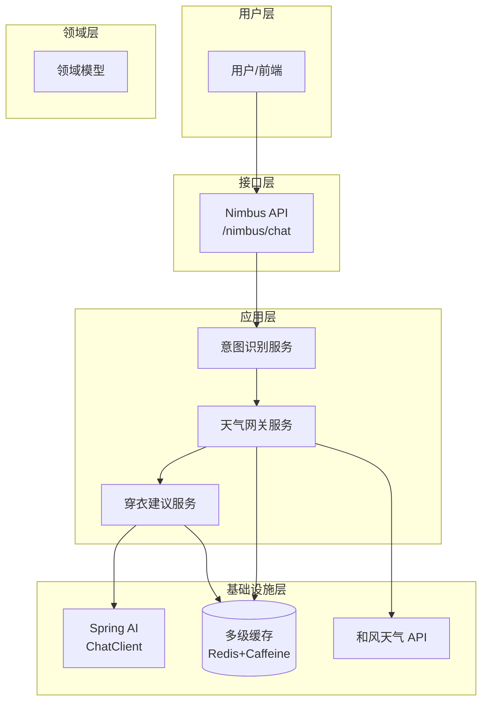
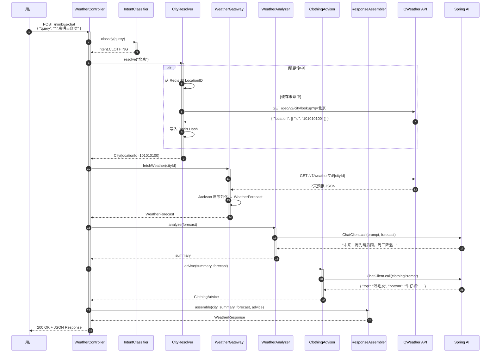
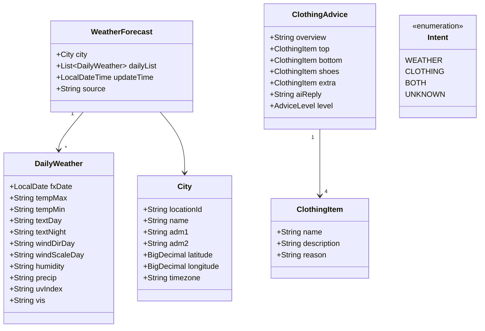

# Nimbus - 智能天气助手设计文档

> 基于 Spring AI 的自然语言天气查询与穿搭推荐系统

---

## 目录

1. [项目概述](#1-项目概述)
2. [技术栈选型](#2-技术栈选型)
3. [系统架构](#3-系统架构)
4. [模块结构](#4-模块结构)
5. [核心数据流转](#5-核心数据流转)
6. [领域模型](#6-领域模型)
7. [关键实现点](#7-关键实现点)
8. [API 接口设计](#8-api-接口设计)
9. [配置管理](#9-配置管理)
10. [异常处理与降级](#10-异常处理与降级)
11. [测试策略](#11-测试策略)
12. [扩展规划](#12-扩展规划)
13. [开发里程碑](#13-开发里程碑)
14. [参考资源](#14-参考资源)

---

## 1. 项目概述

### 1.1 项目背景

Nimbus 是一个基于 **Spring AI** 的智能天气助手，通过自然语言交互为用户提供精准的天气查询和个性化穿衣建议。项目旨在实践 LLM 工程化能力，将 AI 能力无缝集成到传统 Java 应用中。

### 1.2 核心特性

| 特性 | 说明 |
|-----|------|
| 🤖 AI 意图识别 | 自然语言理解，无需记忆固定指令 |
| 🌤️ 精准天气 | 接入和风天气专业 API |
| 🧥 智能穿搭 | 基于天气数据的个性化穿衣推荐 |
| ⚡ 极速响应 | Redis + Caffeine 多级缓存 |
| 🛡️ 稳定可靠 | 熔断降级，服务可用性保障 |

### 1.3 目标用户

- **通勤族**：快速了解今日天气与穿搭
- **差旅人士**：提前掌握目的地天气状况
- **户外爱好者**：关注天气变化趋势

---

## 2. 技术栈选型

| 层级           | 技术                             | 理由                                            |
| ------------ | ------------------------------ | --------------------------------------------- |
| **AI 层**     | Spring AI (OpenAI/智谱/DeepSeek) | 统一管理 Prompt 和 Function Calling，简历写"LLM 工程化实践" |
| **数据层**      | Redis + Caffeine 本地缓存          | 天气数据 1h 过期，防和风 QPS 限制；热点城市内存缓存提速              |
| **HTTP 客户端** | WebClient (WebFlux)            | 非阻塞调和风 API，后续扩展并发抓取不卡线程                       |
| **任务调度**     | Spring Scheduler + 异步 @Async   | 定时刷新天气数据，用户查询走缓存                              |
| **数据映射**     | Jackson + Record(Java 17+)     | 和风 JSON 直接反序列化，Record 省样板代码                   |


### 2.1 Spring AI 版本说明

| 组件 | 版本 | 说明 |
|-----|-----|-----|
| spring-ai-bom | 1.0.0-M3 | 目前最新里程碑版本 |
| spring-ai-openai-spring-boot-starter | 1.0.0-M3 | OpenAI 支持 |
| spring-ai-zhipuai-spring-boot-starter | 1.0.0-M3 | 智谱 AI 支持 |
| spring-ai-ollama-spring-boot-starter | 1.0.0-M3 | 本地 Ollama 支持（可选） |

**Maven 配置示例：**

```xml
<dependencyManagement>
    <dependencies>
        <dependency>
            <groupId>org.springframework.ai</groupId>
            <artifactId>spring-ai-bom</artifactId>
            <version>1.0.0-M3</version>
            <type>pom</type>
            <scope>import</scope>
        </dependency>
    </dependencies>
</dependencyManagement>
```

---

## 3. 系统架构



---

## 4. 模块结构（Maven 多模块）

```
nimbus/
├── nimbus-bootstrap          // SpringBoot 启动入口，依赖聚合
│   └── src/main/java/com/nimbus/bootstrap/
│       └── NimbusApplication.java
│
├── nimbus-api                // REST 接口层
│   └── controller/
│       └── WeatherController.java    // /nimbus/chat 端点
│
├── nimbus-application        // 应用服务层
│   ├── intent/
│   │   ├── Intent.java               // 意图枚举
│   │   └── IntentClassifier.java     // 意图识别器
│   ├── recommendation/
│   │   ├── ClothingAdvisor.java      // 穿衣建议器
│   │   └── RuleEngine.java           // 规则引擎
│   └── service/
│       └── WeatherQueryService.java  // 查询编排服务
│
├── nimbus-domain             // 领域对象
│   ├── model/
│   │   ├── City.java
│   │   ├── WeatherForecast.java
│   │   ├── DailyWeather.java
│   │   └── ClothingAdvice.java
│   └── repository/
│       └── WeatherRepository.java    // 领域仓储接口
│
├── nimbus-infrastructure     // 基础设施层
│   ├── weather/
│   │   ├── QWeatherClient.java       // 和风 API 客户端
│   │   └── WeatherClientFallback.java // 熔断降级
│   ├── cache/
│   │   ├── CacheConfig.java          // Caffeine 配置
│   │   └── RedisCacheService.java    // Redis 封装
│   └── ai/
│       ├── ChatClientConfig.java     // Spring AI 配置
│       └── PromptTemplateLoader.java // Prompt 加载器
│
└── nimbus-common             // 公共模块
    ├── exception/
    │   └── NimbusException.java
    └── util/
        └── JsonUtils.java
```

### 4.1 模块依赖关系

```
nimbus-bootstrap
    ↓
nimbus-api
    ↓
nimbus-application
    ↓
nimbus-domain ← nimbus-infrastructure
    ↓
nimbus-common
```


## 5. 核心数据流转

### 5.1 时序图



### 5.2 流程说明

| 步骤 | 组件 | 职责 |
|:---:|:---|:---|
| 1 | WeatherController | 接收用户查询请求 |
| 2-3 | IntentClassifier | 识别用户意图（天气查询/穿衣建议/两者） |
| 4-8 | CityResolver | 城市名称→LocationID 映射，优先走缓存 |
| 9-12 | WeatherGateway | 调用和风 API 获取天气数据 |
| 13-16 | WeatherAnalyzer | Spring AI 分析天气趋势 |
| 17-20 | ClothingAdvisor | 基于 AI 推荐穿搭 |
| 21-23 | ResponseAssembler | 组装统一响应格式 |

---

## 6. 领域模型

### 6.1 类图



### 6.2 实体说明

| 实体 | 说明 | 关键字段 |
|:---|:---|:---|
| **City** | 城市信息 | locationId(和风9位ID)、经纬度 |
| **WeatherForecast** | 天气预报聚合 | 包含7天数据、更新时间 |
| **DailyWeather** | 单日天气 | 温度、天气状况、风力湿度等 |
| **ClothingAdvice** | 穿衣建议 | 概述+四类单品+AI自然语言回复 |
| **Intent** | 用户意图枚举 | 用于路由到不同处理逻辑 |


## 7. 关键实现点

### 7.1 意图识别

#### 7.1.1 方案对比

| 方案 | 优点 | 缺点 | 适用场景 |
|:---|:---|:---|:---|
| **关键字匹配** | 零成本、快速 | 扩展性差 | MVP阶段 |
| **正则表达式** | 精确控制 | 维护复杂 | 固定句式 |
| **LLM分类** | 准确率高、自然 | 有Token成本 | 生产环境 |

#### 7.1.2 轻量级实现（MVP）

```java
@Component
public class IntentClassifier {

    private static final List<String> CLOTHING_KEYWORDS = List.of(
        "穿", "带伞", "衣服", "外套", "怎么穿"
    );

    private static final List<String> WEATHER_KEYWORDS = List.of(
        "天气", "几度", "温度", "下雨", "刮风"
    );

    public Intent classify(String query) {
        boolean hasClothing = CLOTHING_KEYWORDS.stream()
            .anyMatch(query::contains);
        boolean hasWeather = WEATHER_KEYWORDS.stream()
            .anyMatch(query::contains);

        if (hasClothing && hasWeather) return Intent.BOTH;
        if (hasClothing) return Intent.CLOTHING;
        if (hasWeather) return Intent.WEATHER;
        return Intent.UNKNOWN;
    }
}
```

#### 7.1.3 LLM 分类实现（生产）

```java
@Component
public class LLMIntentClassifier {

    private final ChatClient chatClient;

    private static final String INTENT_PROMPT = """
        分析用户查询意图，从以下选项中选择：
        - WEATHER: 仅查询天气信息
        - CLOTHING: 仅询问穿衣建议
        - BOTH: 既查天气又要穿衣建议
        - UNKNOWN: 无法识别

        用户查询: {query}
        只返回意图代码，不要解释。
        """;

    public Intent classify(String query) {
        String result = chatClient.prompt()
            .user(u -> u.text(INTENT_PROMPT).param("query", query))
            .call()
            .content();
        return Intent.valueOf(result.trim());
    }
}
```

---

### 7.2 和风 API 防熔断

```java
@Component
public class QWeatherClient {

    private final WebClient webClient;

    @CircuitBreaker(name = "qweather", fallbackMethod = "fallbackToCache")
    @Retry(name = "qweather")
    public WeatherDTO fetch7DayForecast(String cityId) {
        return webClient.get()
            .uri(uriBuilder -> uriBuilder
                .path("/v7/weather/7d/{cityId}")
                .queryParam("key", apiKey)
                .build(cityId))
            .retrieve()
            .bodyToMono(WeatherDTO.class)
            .block();
    }

    // 降级方法：返回缓存中的旧数据
    public WeatherDTO fallbackToCache(String cityId, Throwable ex) {
        log.warn("QWeather API 失败，降级到缓存: {}", cityId, ex);
        return cacheService.getWeather(cityId)
            .orElseThrow(() -> new WeatherException("服务暂时不可用，请稍后重试"));
    }
}
```

---

### 7.3 Prompt 工程（核心亮点）

#### 7.3.1 系统 Prompt 设计

```yaml
nimbus:
  ai:
    prompts:
      weather-analysis: |
        你是 Nimbus，一位专业的天气分析师。

        输入数据：7天天气预报 JSON
        用户问题：{userQuery}

        约束：
        1. 天气总结不超过 3 句话
        2. 指出温度剧烈变化（温差>8℃）的日期
        3. 标记需要特别注意的天气（暴雨、大风、极端高温/低温）
        4. 语气轻松友好，适当使用 emoji

        输出格式：纯文本总结

      clothing-advice: |
        你是 Nimbus，一位懂穿搭的天气助手。

        天气总结：{weatherSummary}
        详细数据：{weatherData}

        约束：
        1. 穿衣建议必须包含"上装/下装/鞋/配件"四类
        2. 有雨必提醒带伞，温差>8℃必提醒洋葱穿衣法
        3. 考虑湿度、风力对体感温度的影响
        4. 语气轻松，用 emoji

        输出格式（严格JSON）：
        {
          "overview": "一句话总结",
          "top": { "name": "单品名", "reason": "推荐理由" },
          "bottom": { "name": "单品名", "reason": "推荐理由" },
          "shoes": { "name": "单品名", "reason": "推荐理由" },
          "extra": { "name": "单品名", "reason": "推荐理由" },
          "aiReply": "自然语言回复"
        }
```

---

### 7.4 城市 ID 映射表

和风 LocationID 是 9 位数字（如北京 101010100）。

**方案**：启动时加载 `city-list.json`（和风提供）到 Redis Hash

```java
@Component
public class CityDataInitializer implements CommandLineRunner {

    @Override
    public void run(String... args) throws Exception {
        // 从 resources/city-list.json 加载
        List<City> cities = loadCityList();

        // 写入 Redis Hash: nimbus:city
        Map<String, String> cityMap = cities.stream()
            .collect(Collectors.toMap(
                City::getName,
                City::getLocationId,
                (v1, v2) -> v1  // 处理重名城市
            ));

        redisTemplate.opsForHash().putAll("nimbus:city", cityMap);
    }
}
```

---

## 8. API 接口设计

### 8.1 接口列表

| 方法 | 路径 | 说明 |
|:---|:---|:---|
| POST | `/nimbus/chat` | 自然语言查询（主接口） |
| GET | `/nimbus/weather/{city}` | 直接查询天气 |
| GET | `/nimbus/cities?q={keyword}` | 城市搜索 |
| GET | `/nimbus/health` | 健康检查 |

### 8.2 主接口详细设计

#### Request

```http
POST /nimbus/chat
Content-Type: application/json

{
  "query": "上海未来一周怎么样",
  "userId": "user_123",      // 可选，用于个性化
  "location": {              // 可选，优先使用
    "lat": 31.2304,
    "lon": 121.4737
  }
}
```

#### Response - 成功 (200 OK)

```json
{
  "success": true,
  "data": {
    "city": {
      "name": "上海",
      "locationId": "101020100"
    },
    "summary": "未来一周先晴后雨，周三降温 🌦️",
    "daily": [
      {
        "date": "2025-02-07",
        "tempMax": "12",
        "tempMin": "6",
        "textDay": "晴",
        "textNight": "多云",
        "windDir": "东北风",
        "windScale": "3-4级"
      }
      // ... 后续6天
    ],
    "clothingAdvice": {
      "overview": "建议春装外套+长裤",
      "details": {
        "top": { "name": "薄毛衣", "reason": "白天较暖，早晚凉" },
        "bottom": { "name": "牛仔裤", "reason": "防风保暖" },
        "shoes": { "name": "运动鞋", "reason": "舒适通勤" },
        "extra": { "name": "轻薄外套", "reason": "应对降温" }
      },
      "aiReply": "上海这周天气不错哦～周四记得带伞 🌂"
    }
  },
  "timestamp": "2025-02-06T10:30:00Z"
}
```

#### Response - 错误示例

```json
{
  "success": false,
  "error": {
    "code": "CITY_NOT_FOUND",
    "message": "未找到城市 '火星'，请检查城市名称",
    "suggestions": ["尝试使用：北京、上海、广州..."]
  },
  "timestamp": "2025-02-06T10:30:00Z"
}
```

### 8.3 错误码规范

| 错误码 | 说明 | HTTP状态码 |
|:---|:---|:---:|
| `INVALID_REQUEST` | 请求参数错误 | 400 |
| `CITY_NOT_FOUND` | 城市未找到 | 404 |
| `WEATHER_API_ERROR` | 天气服务异常 | 503 |
| `AI_SERVICE_ERROR` | AI 服务超时 | 503 |
| `RATE_LIMITED` | 请求频率限制 | 429 |
| `INTERNAL_ERROR` | 内部错误 | 500 |


---

## 9. 配置管理

### 9.1 完整配置示例

```yaml
# application.yml
spring:
  application:
    name: nimbus

  # Redis 配置
  data:
    redis:
      host: localhost
      port: 6379
      database: 0
      timeout: 5s
      lettuce:
        pool:
          max-active: 8
          max-idle: 8

  # AI 配置
  ai:
    openai:
      api-key: ${OPENAI_API_KEY}
      base-url: https://api.openai.com
      chat:
        options:
          model: gpt-4o-mini
          temperature: 0.7
    # 或智谱 AI
    zhipuai:
      api-key: ${ZHIPU_API_KEY}

# 和风天气配置
nimbus:
  weather:
    qweather:
      api-key: ${QWEATHER_KEY}
      base-url: https://devapi.qweather.com
      geo-url: https://geoapi.qweather.com

  # 缓存配置
  cache:
    caffeine:
      max-size: 1000
      expire-after-write: 30m
    redis:
      weather-ttl: 1h
      city-ttl: 24h

  # AI Prompt 配置
  ai:
    enabled: true
    timeout: 10s
    prompts:
      location: classpath:/prompts/

# Resilience4j 熔断配置
resilience4j:
  circuitbreaker:
    configs:
      default:
        sliding-window-size: 10
        failure-rate-threshold: 50
        wait-duration-in-open-state: 10s
    instances:
      qweather:
        base-config: default
  retry:
    configs:
      default:
        max-attempts: 3
        wait-duration: 1s
```

### 9.2 多环境配置

```
nimbus-bootstrap/src/main/resources/
├── application.yml          # 公共配置
├── application-dev.yml      # 开发环境
├── application-test.yml     # 测试环境
├── application-prod.yml     # 生产环境
└── prompts/                 # Prompt 模板
    ├── weather-analysis.txt
    ├── clothing-advice.txt
    └── intent-classify.txt
```

---

## 10. 异常处理与降级

### 10.1 异常处理策略

| 异常场景 | 处理策略 | 降级方案 |
|:---|:---|:---|
| QWeather API 限流 | Resilience4j 熔断 | 返回缓存数据 |
| QWeather API 故障 | 3次重试后熔断 | 返回缓存数据+友好提示 |
| AI 服务超时 | 3s超时限制 | 返回基础穿衣规则结果 |
| Redis 故障 | 异常捕获不中断 | 降级到Caffeine本地缓存 |
| 城市ID未找到 | 调用GeoAPI搜索 | 提示用户选择正确城市名 |

### 10.2 全局异常处理器

```java
@RestControllerAdvice
@Slf4j
public class GlobalExceptionHandler {

    @ExceptionHandler(CityNotFoundException.class)
    public ResponseEntity<ErrorResponse> handleCityNotFound(CityNotFoundException e) {
        return ResponseEntity.status(HttpStatus.NOT_FOUND)
            .body(ErrorResponse.builder()
                .code("CITY_NOT_FOUND")
                .message(e.getMessage())
                .suggestions(List.of("尝试使用：北京、上海、广州..."))
                .build());
    }

    @ExceptionHandler(WeatherApiException.class)
    public ResponseEntity<ErrorResponse> handleWeatherApiError(WeatherApiException e) {
        log.error("天气服务异常", e);
        return ResponseEntity.status(HttpStatus.SERVICE_UNAVAILABLE)
            .body(ErrorResponse.builder()
                .code("WEATHER_API_ERROR")
                .message("天气服务暂时不可用，请稍后重试")
                .build());
    }

    @ExceptionHandler(Exception.class)
    public ResponseEntity<ErrorResponse> handleGeneric(Exception e) {
        log.error("系统异常", e);
        return ResponseEntity.status(HttpStatus.INTERNAL_SERVER_ERROR)
            .body(ErrorResponse.builder()
                .code("INTERNAL_ERROR")
                .message("系统繁忙，请稍后重试")
                .build());
    }
}
```

---

## 11. 测试策略

### 11.1 测试分层

```
test/
├── unit/                    # 单元测试
│   ├── intent/
│   │   └── IntentClassifierTest.java
│   ├── service/
│   │   └── WeatherQueryServiceTest.java
│   └── domain/
│       └── ClothingAdviceTest.java
├── integration/             # 集成测试
│   ├── cache/
│   │   └── RedisCacheTest.java
│   ├── ai/
│   │   └── ChatClientTest.java
│   └── api/
│       └── WeatherControllerTest.java
└── contract/                # 契约测试
    └── QWeatherApiContractTest.java
```

### 11.2 关键测试用例

#### Prompt 测试

```java
@SpringBootTest
class PromptTemplateTest {

    @Autowired
    private ChatClient chatClient;

    @Test
    void testWeatherAnalysisPrompt() {
        String result = chatClient.prompt()
            .user("分析以下天气：{ \"temp\": 25, \"condition\": \"晴\" }")
            .call()
            .content();

        assertThat(result).containsAnyOf("晴", "温度");
    }
}
```

#### API 契约测试（WireMock）

```java
@SpringBootTest
@AutoConfigureWireMock(port = 0)
class QWeatherContractTest {

    @Value("${wiremock.server.port}")
    private int wireMockPort;

    @Test
    void testFetch7DayForecast() {
        // 配置 WireMock
        stubFor(get(urlPathMatching("/v7/weather/7d/.*"))
            .willReturn(aResponse()
                .withStatus(200)
                .withHeader("Content-Type", "application/json")
                .withBodyFile("qweather-7d-response.json")));

        // 执行测试...
    }
}
```

---

## 12. 扩展规划

### 12.1 Function Calling（高级特性）

让 LLM 自己决定要不要调用天气 API：

```java
@Bean
public FunctionCallback weatherFunction(QWeatherClient client) {
    return FunctionCallback.builder()
        .function("getWeather", new WeatherFunction(client))
        .description("获取指定城市的天气信息")
        .inputType(WeatherRequest.class)
        .build();
}
```

### 12.2 用户画像

```java
@Entity
public class UserPreference {
    private String userId;
    private TemperatureSensitivity tempSensitivity; // COLD_SENSITIVE / HOT_SENSITIVE / NORMAL
    private StylePreference style; // CASUAL / FORMAL / SPORT
    private Set<String> favoriteCities;
}
```

### 12.3 定时预取

```java
@Component
@Slf4j
public class WeatherPrefetchJob {

    @Scheduled(cron = "0 0 3 * * ?") // 每天凌晨3点
    public void prefetchPopularCities() {
        // 获取用户常查的TOP20城市
        // 预拉数据入缓存
    }
}
```

### 12.4 极端天气预警（WebSocket）

```java
@Component
public class WeatherAlarmService {

    @Scheduled(fixedDelay = 60000) // 每分钟检查
    public void checkAlarms() {
        // 调和风 Alarms API
        // 推送 WebSocket 消息
    }
}
```

---

## 13. 开发里程碑

| 阶段 | 目标 | 产出 | 预计工期 |
|:---|:---|:---|:---:|
| **MVP** | 基础天气查询+简单穿衣规则 | 单模块 SpringBoot，硬编码10城市 | 3天 |
| **V1.0** | 接入 Spring AI，自然语言回复 | 多模块拆分，Prompt 调优 | 5天 |
| **V1.5** | 加缓存+城市搜索+异常处理 | 可演示的完整项目 | 5天 |
| **V2.0** | Function Calling + 用户画像 | 智能化进阶版本 | 7天 |
| **V2.5** | 定时预取 + 极端天气预警 | 企业级可用版本 | 7天 |

### 13.1 MVP 任务拆解

- [ ] 搭建 SpringBoot 单模块项目
- [ ] 集成 WebClient 调用和风 API
- [ ] 实现天气数据 JSON 解析
- [ ] 硬编码 10 个热门城市
- [ ] 基于温度规则的穿衣建议
- [ ] 单测覆盖核心逻辑

---

## 14. 参考资源

### 14.1 官方文档

| 资源 | 链接 |
|:---|:---|
| Spring AI 官方文档 | https://docs.spring.io/spring-ai/reference/ |
| Spring AI GitHub | https://github.com/spring-projects/spring-ai |
| 和风天气 API 文档 | https://dev.qweather.com/docs/ |
| Resilience4j 文档 | https://resilience4j.readme.io/ |

### 14.2 术语表

| 术语 | 说明 |
|:---|:---|
| **Function Calling** | LLM 调用外部函数的能力 |
| **LocationID** | 和风天气的城市唯一标识（9位数字） |
| **Prompt Engineering** | 设计和优化 AI 提示词的技术 |
| **Circuit Breaker** | 熔断器模式，防止级联故障 |
| **DDD** | 领域驱动设计 (Domain-Driven Design) |

---

*文档版本: v1.0*
*最后更新: 2025-02-06*
